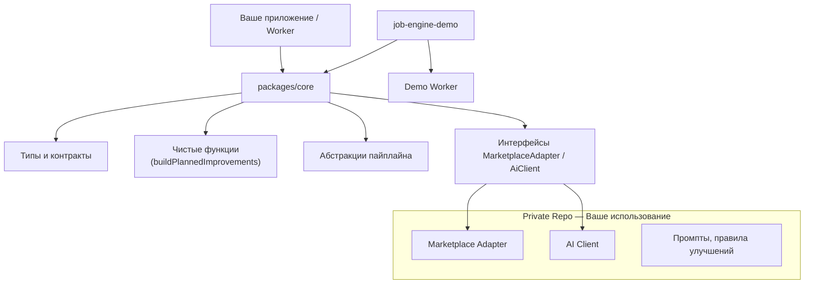
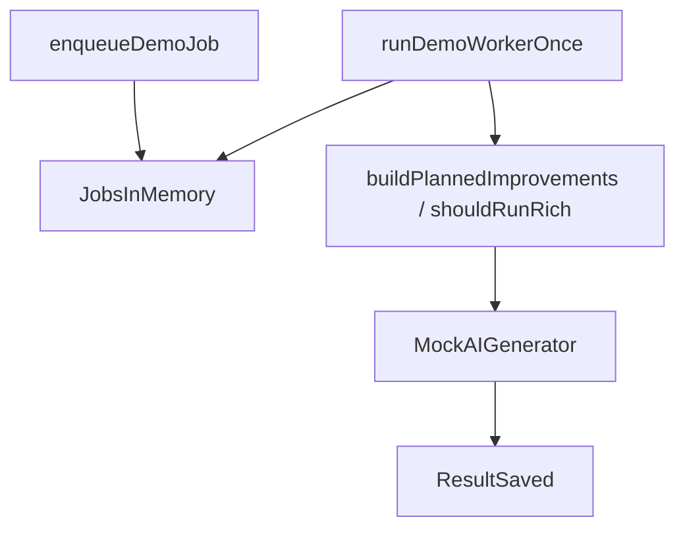

# Architecture.md — Mplace AI Public Core Architecture

## Overview

Mplace AI Public Core — модульное ядро для AI-обработки товарных данных маркетплейсов.
Оно предоставляет унифицированные типы, контракты, абстракции пайплайнов и чистые функции анализа контента.

Public Core *не содержит*:
- привязки к конкретным маркетплейсам,
- промптов,
- баз данных,
- логики биллинга,
- авторизации,
- API ключей.

Все конкретные интеграции находятся в Private Repo, который подключается через адаптеры.

## 1. High-Level Architecture



## 2. Пакет packages/core

Пакет содержит чистые доменные модели и расширяемые контракты, не привязанные к конкретному маркетплейсу.

### 2.1 Типы продукта (types/product.ts)

#### ProductRef

```ts
interface ProductRef {
  id: string;
  sku?: string | number;
}
```

#### ProductSnapshot

```ts
interface ProductSnapshot {
  ref: ProductRef;
  text?: {
    name?: string;
    brand?: string;
    annotation?: string;
    richContentJson?: unknown;
  };
  media?: {
    images?: string[];
    videos?: string[];
  };
  attributes?: Record<string, unknown>;
  hashtags?: string[] | null;
  rating?: RatingEntry | null;
  extra?: Record<string, unknown>;
}
```

### 2.2 Типы задач (types/job.ts)

#### JobPayload

```ts
interface JobPayload {
  version: number;
  kind: JobKind;
  target?: Record<string, unknown>;
  plan?: PlannedJobPlan;
  metadata?: Record<string, unknown>;
}
```

#### JobItemInputSnapshot

```ts
interface JobItemInputSnapshot {
  product?: ProductSnapshot;
  ratingAtEnqueue?: number | null;
  ratingEntry?: unknown;
  plannedImprovements?: PlannedImprovements;
}
```

#### JobItemResultSnapshot

Описание результата обработки товара.

### 2.3 Пайплайны (types/pipeline.ts)

#### PipelineContext

```ts
interface PipelineContext {
  jobId: string;
  itemId: string;
  now: () => Date;
  deps?: Record<string, unknown>;
}
```

#### PipelineStep

```ts
async (ctx, snapshot) => PipelineResult
```

### 2.4 Адаптеры (types/adapter.ts)

#### MarketplaceAdapter

```ts
interface MarketplaceAdapter {
  name: string;

  fetchProductSnapshot(ref: ProductRef): Promise<ProductSnapshot>;

  applyProductChanges(
    ref: ProductRef,
    changes: Record<string, unknown>
  ): Promise<unknown>;
}
```

#### AiClient

```ts
interface AiClient {
  provider: string;
  generate(
    mode: string,
    payload: Record<string, unknown>
  ): Promise<Record<string, unknown>>;
}
```

### 2.5 Чистая логика улучшений

#### buildPlannedImprovementsFromRating

Чистая функция анализа рейтинга и генерации улучшений.

#### shouldRunRich

Решает, запускать ли rich-content генерацию.

## 3. Demo Job Engine (packages/job-engine-demo)

Минимальный демонстрационный движок.

### Demo Flow



## 4. Что не входит в public-core

Public-core НЕ содержит:
- реализации marketplace API
- sellerId / enterpriseId / profileId
- биллинг
- Prisma
- реальных AI моделей

## 5. Roadmap

- улучшение типизации media/attributes/hashtags
- пример адаптера marketplace
- CLI worker
- npm-публикация
- интеграция Prisma примеров
